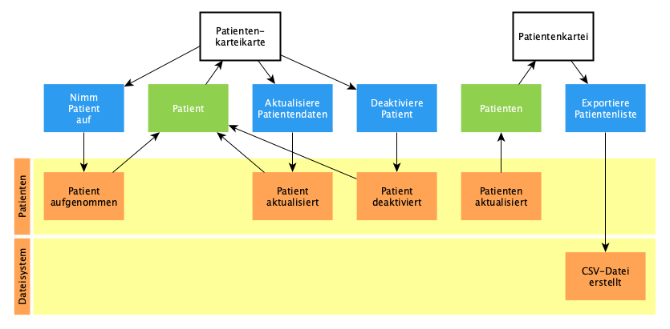
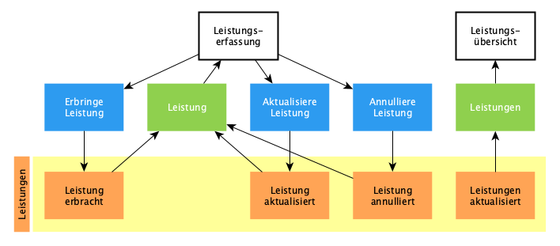
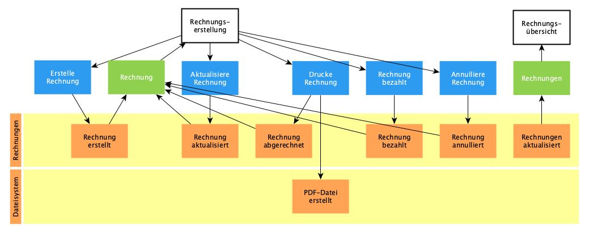
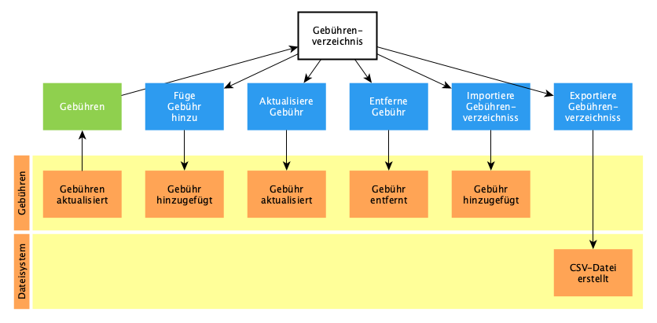
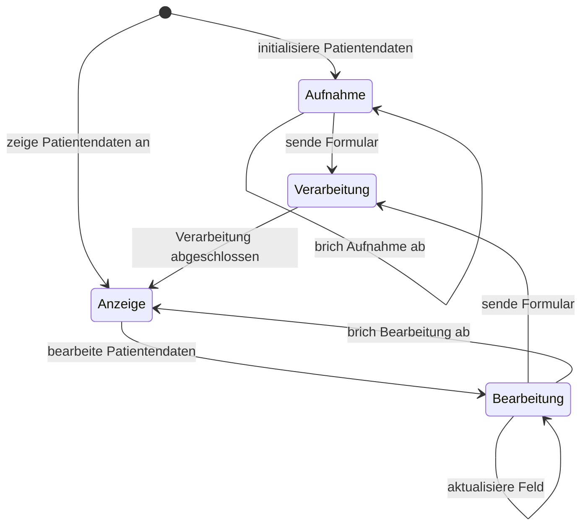

# Naturheilpraxis

Mit dieser App können Heilpraktiker Leistungen für Patienten erfassen, um ihnen
diese in Rechnung stellen zu können.

## Domain

Stories für den MVP sind mit ❗ markiert.

### Patienten

#### Nimm Patient auf

- [x] ❗Erfasse Informationen wie Name, Geburtsdatum, Praxis, Annahmejahr,
      Anschrift und Kontaktmöglichkeit
- [ ] Nutze aktuelle Praxis als Standardpraxis
- [ ] Nutze aktuelles Jahr als Annahmejahr
- [ ] Unterscheide zwischen gesetzlicher und privater Krankenversicherung
- [ ] Wenn ein Patient mit demselben Nachnamen, Vornamen und Geburtsdatum
      existiert, muss der Nutzer die Aufnahme bestätigen
- [ ] Wenn eines der Pflichtfelder Nachname, Vorname, Geburtsdatum, Annahmejahr
      und Praxis nicht ausgefüllt ist, muss der Nutzer die Aufnahme bestätigen

#### Suche Patient

- [x] ❗Suche Patient mit Nummer

#### Aktualisiere Patient

- [ ] Sichere Änderungen eines Patienten
- [ ] Wenn eines der Pflichtfelder Nachname, Vorname, Geburtsdatum, Annahmejahr
      und Praxis nicht ausgefüllt ist, muss der Nutzer die Aktualisierung
      bestätigen

#### Suche Patienten

- [x] ❗Liste alle Patienten auf
- [ ] Suche Patient(en) nach einem beliebigen Feld
- [ ] Sortiere nach einem sichtbaren Feld
- [ ] Konfiguriere sichtbare Felder
- [ ] Blende inaktive Patienten aus

#### Deaktiviere Patient

- [ ] Setze den Status eines Patienten auf inaktiv

#### Exportiere CSV-Datei

- [ ] Exportiere (gefilterte) Liste von Patienten in CSV-Datei

### Diagnosen

#### Erstelle Diagnose

- [ ] ❗Erfasse eine Diagnose mit Datum und Beschreibung für einen Patienten

#### Suche Diagnosen

- [ ] ❗Liste alle Diagnosen für einen Patienten auf
- [ ] Suche Diagnose(n) mit Datum oder Beschreibung

#### Aktualisiere Diagnose

- [ ] Sichere Änderung einer Diagnose

#### Entferne Diagnose

- [ ] Lösche eine Diagnose

### Leistungen

#### Erbringe Leistung

- [ ] ❗Erfasse Leistung für einen Patienten mit Datum, einer Gebühr und
      optionalen Kommentar

#### Suche Leistungen

- [ ] ❗Liste alle Leistungen für einen Patienten auf
- [ ] Suche Leistung(en) nach einem beliebigen Feld

#### Aktualisiere Leistung

- [ ] Sichere Änderung einer Leistung
- [ ] **Constraint:** Nur nicht abgerechnete Leistungen können aktualisiert
      werden

#### Annulliere Leistung

- [ ] Lösche Leistung
- [ ] **Constraint:** Nur nicht abgerechnete Leistungen können annulliert werden

### Rechnungen

#### Erstelle Rechnung

- [ ] ❗Erstelle Rechnung für einen Patienten mit Datum, Leistungen und
      optionaler Diagnose
- [ ] ❗Bestimme Rechnungsnummer aus Patientennummer und Rechnungsdatum:
      NNNN/JJMMDD
- [ ] ❗Nutze Zahlungsziel und Kontoverbindung als Defaultwert für Rechnungstext
- [ ] **Constraint:** Nur nicht abgerechnete Leistungen können einer Rechnung
      hinzugefügt werden
- [ ] **Constraint:** Patient, Diagnose und Leistungen dürfen nach Fakturierung
      der Rechnung nicht mehr geändert werden

#### Suche Rechnung

- [ ] Suche Rechnung mit ID

#### Aktualisiere Rechnung

- [ ] Sichere Änderung einer Rechnung
- [ ] **Constraint:** Nur nicht fakturierte Rechnungen können aktualisiert
      werden

#### Annulliere Rechnung

- [ ] Lösche eine Rechnung
- [ ] **Constraint:** Nur nicht fakturierte Rechnungen können annulliert werden

#### Drucke Rechnung

- [ ] ❗Drucke Rechnung mit Leistungsbezeichnung
- [ ] Drucke Rechnung ohne Leistungsbezeichnung

#### Suche Rechnungen

- [ ] ❗Liste alle Rechnungen auf
- [ ] Liste Rechnungen eines Patienten auf
- [ ] Liste Rechnungen einer Praxis auf
- [ ] Suche Rechnung(en) nach einem beliebigen Feld
- [ ] Sortiere nach Status und Datum
- [ ] Blende bezahlte Rechnungen aus

#### Fakturiere Rechnung

- [ ] Setze Rechnungsstatus auf fakturiert
- [ ] Markiere alle enthaltenen Leistungen als abgerechnet

#### Markiere Rechnung als bezahlt

- [ ] Setze Rechnungsstatus auf bezahlt

#### Mahne Rechnung

- [ ] Setze Rechnungsstatus auf gemahnt

#### Storniere Rechnung

- [ ] Setze Rechnungsstatus auf storniert
- [ ] Frage vor dem Stornieren beim Nutzer nach
- [ ] Gib alle enthaltenen Leistungen wieder frei

### Gebühren

#### Suche Gebühren

- [ ] Liste alle Gebühren auf
- [ ] Suche Gebühr(en) nach Ziffer oder Beschreibung

#### Aktualisiere Gebühr

- [ ] Sichere die Änderung einer Gebühr

#### Füge Gebühr hinzu

- [ ] Lege eine Gebühr mit Ziffer und Beschreibung an
- [ ] **Contraint:** Die Ziffer muss eindeutig sein

#### Entferne Gebühr

- [ ] Lösche eine Gebühr

## Architecture

[Architecture Communication Canvas](https://html-preview.github.io/?url=https://github.com/falkoschumann/naturheilpraxis/blob/main/doc/acc.html)

## Flow

### Patientenkarteikarte

