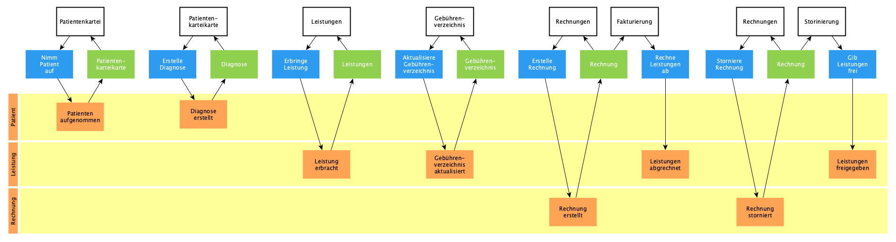

# Naturheilpraxis

Als Heilpraktiker möchte ich die Leistungen für Patienten erfassen, um ihnen
diese in Rechnung stellen zu können.

## Domain

### Nimm Patient auf

- [ ] Erfasse Informationen wie Name, Geburtsdatum, Praxis, Annahmejahr,
      Anschrift, Kontaktmöglichkeit
- [ ] Nutze aktuelle Praxis als Standardpraxis für den Patienten
- [ ] **Constraint:** Prüfe vor dem Anlegen, ob bereits ein Patient mit dem
      selben Namen und Geburtsdatum aufgenommen wurde
- [ ] Aktualisiere eine Patientenkarteikarte
- [ ] Setze einen Patient auf inaktiv mit einem optionalen Grund

### Patientenkarteikarte

- [ ] Liste alle Patienten auf
- [ ] Suche Patient
- [ ] Filtere inaktive Patienten aus

### Erstelle Diagnose

- [ ] Erfasse eine Diagnose mit Datum und Beschreibung
- [ ] Aktualisiere eine Diagnose
- [ ] Entferne eine Diagnose
- [ ] **Constraint:** Prüfe vor dem Entfernen, ob die Diagnose in einer Rechnung
      verwendet wird

### Diagnose

- [ ] Liste alle Diagnosen für einen Patient auf

### Erbringe Leistung

- [ ] Erfasse Leistungen mit Datum, einer Gebühr und optionalen Kommentar
- [ ] Aktualisiere Leistung
- [ ] **Constraint:** Nur nicht abgerechnete Leistungen können aktualisiert
      werden
- [ ] Annulliere Leistung
- [ ] **Constraint:** Nur nicht abgerechnete Leistungen können annulliert werden

### Leistungen

- [ ] Liste alle Leistungen für einen Patient auf
- [ ] Filtere abgerechnete Leistungen aus

### Aktualisiere Gebührenverzeichnis

- [ ] Lege eine Gebühr mit Ziffer und Beschreibung an
- [ ] Aktualisiere eine Gebühr
- [ ] Lösche eine Gebühr

### Gebührenverzeichnis

- [ ] Liste alle Gebühren auf
- [ ] Suche eine Gebühr

### Erstelle Rechnung

- [ ] Wähle Leistungen für Rechnung
- [ ] Wähle optional eine Diagnose
- [ ] Bestimme Rechnungsnummer aus Patientennummer und Rechnungsdatum
- [ ] Nutze Zahlungsziel und Kontoverbindung als Default für den Rechnungstext
- [ ] Erstelle Rechnung
- [ ] **Constraint:** Kopiere Daten der Leistungen und Diagnose in die Rechnung,
      damit diese nicht geändert werden, wenn die ursprüngliche Gebühr oder
      Diagnose geändert wird
- [ ] **Constraint:** Wenn Rechnungen nacheinander angelegt werden, verwende das
      letztes Rechnungsdatum für die nächste Rechnung als Default
- [ ] Drucke Rechnung
- [ ] Drucke Rechnung mit oder ohne Leistungsbezeichnung

### Rechnung

- [ ] Liste alle Rechnungen auf
- [ ] Liste alle Rechnungen eines Patienten auf
- [ ] Liste alle Rechnungen einer Praxis auf

### Rechne Leistungen ab

- [ ] Wird eine Rechnung fakturiert, rechne alle enthaltenen Leistungen ab

### Storniere Rechnung

- [ ] Storniere Rechnung
- [ ] **Constraint:** Frage vor dem Stornieren beim Nutzer nach

### Gib Leistungen frei

- [ ] Wird eine Rechnung storniert, gib alle enthaltenen Leistungen wieder frei

## Architecture

[Architecture Communication Canvas](https://html-preview.github.io/?url=https://github.com/falkoschumann/naturheilpraxis/blob/main/doc/acc.html)
