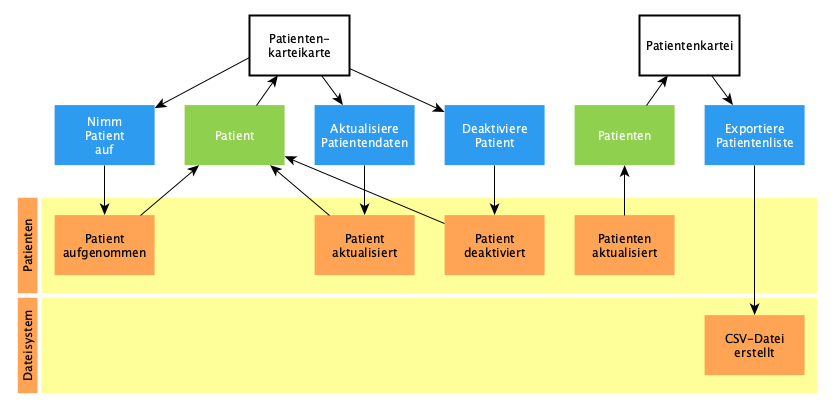
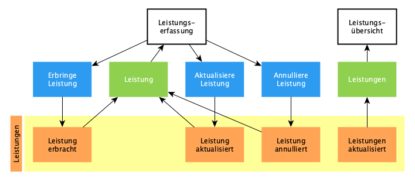
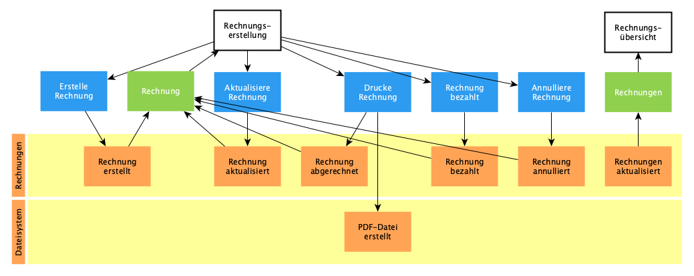
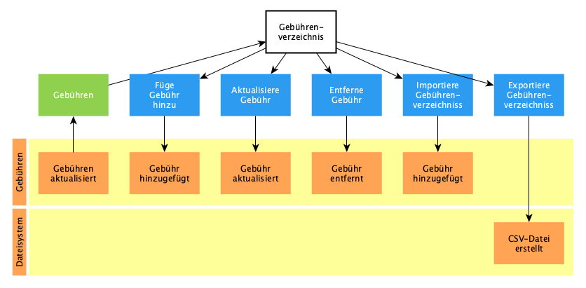

# Naturheilpraxis

Mit dieser App können Heilpraktiker Leistungen für Patienten erfassen, um ihnen
diese in Rechnung stellen zu können. Es werden mehrere Praxen unterstützt.

## Domain

Storys für den MVP sind mit ❗ markiert.

### Patienten

#### Nimm Patient auf

- [x] ❗Erfasse Informationen wie Name, Geburtsdatum, Praxis, Annahmejahr,
      Anschrift und Kontaktmöglichkeit
- [ ] Unterscheide zwischen gesetzlicher und privater Krankenversicherung oder
      Selbstzahler
- [ ] Wenn ein Patient mit demselben Nachnamen, Vornamen und Geburtsdatum
      existiert, muss der Nutzer die Aufnahme bestätigen
- [ ] Wenn eines der Pflichtfelder Nachname, Vorname, Geburtsdatum, Annahmejahr
      und Praxis nicht ausgefüllt ist, muss der Nutzer die Aufnahme bestätigen

#### Patient

- [x] ❗Suche Patient mit Nummer
- [ ] Wenn es den Patienten nicht gibt, initialisiere einen neuen Patienten
- [ ] Nutze aktuelle Praxis als Standard für die Praxis
- [ ] Nutze aktuelles Jahr als Standard für das Annahmejahr

#### Aktualisiere Patient

- [ ] Sichere Änderungen eines Patienten
- [ ] Wenn eines der Pflichtfelder Nachname, Vorname, Geburtsdatum, Annahmejahr
      und Praxis nicht ausgefüllt ist, muss der Nutzer die Aktualisierung
      bestätigen

#### Deaktiviere Patient

- [ ] Setze den Status eines Patienten auf inaktiv

#### Patienten

- [x] ❗Liste alle Patienten auf
- [x] Suche Patient(en) nach einem beliebigen Feld
- [x] Sortiere nach einem sichtbaren Feld
- [ ] Konfiguriere sichtbare Felder
- [ ] Blende inaktive Patienten aus

#### Exportiere Patientenliste

- [ ] Exportiere (gefilterte) Liste von Patienten in eine CSV-Datei

### Diagnosen

#### Stelle Diagnose

- [ ] ❗Erfasse eine Diagnose mit Datum und Beschreibung für einen Patienten

#### Diagnose

- [ ] Suche Diagnose mit ID
- [ ] Wenn es die Diagnose nicht gibt, initialisiere eine neue Diagnose
- [ ] Nutze aktuelles Datum als Standard für das Diagnosedatum

#### Aktualisiere Diagnose

- [ ] Sichere Änderung einer Diagnose

#### Entferne Diagnose

- [ ] Lösche eine Diagnose
- [ ] **Constraint:** Nur Diagnosen, die nicht in einer Rechnung verwendet
      werden, können entfernt werden

#### Diagnosen

- [x] ❗Liste alle Diagnosen für einen Patienten auf
- [x] Suche Diagnosen mit Datum oder Beschreibung

### Leistungen

#### Erbringe Leistung

- [ ] ❗Erfasse Leistung für einen Patienten mit Datum, einer Gebühr und
      optionalen Kommentar

#### Leistung

- [ ] Suche Leistung mit ID
- [ ] Wenn es die Leistung nicht gibt, initialisiere eine neue Leistung
- [ ] Nutze aktuelles Datum als Standard für das Leistungsdatum
- [ ] Nutze das letzte Leistungsdatum als Standard für das Leistungsdatum wenn
      mehrere Leistungen hintereinander erfasst werden

#### Aktualisiere Leistung

- [ ] Sichere Änderung einer Leistung
- [ ] **Constraint:** Nur nicht abgerechnete Leistungen können aktualisiert
      werden

#### Annulliere Leistung

- [ ] Lösche Leistung
- [ ] **Constraint:** Nur nicht abgerechnete Leistungen können annulliert werden

#### Leistungen

- [x] ❗Liste alle Leistungen für einen Patienten auf
- [x] Suche Leistungen nach einem beliebigen Feld

### Rechnungen

#### Erstelle Rechnung

- [ ] ❗Erstelle Rechnung für einen Patienten mit Datum, Leistungen und
      optionalen Diagnosen
- [ ] ❗Bestimme Rechnungsnummer aus Patientennummer und Rechnungsdatum:
      NNNN/JJMMDD
- [ ] ❗Nutze Zahlungsziel und Kontoverbindung als Defaultwert für Rechnungstext
- [ ] **Constraint:** Nur nicht abgerechnete Leistungen können einer Rechnung
      hinzugefügt werden

#### Rechnung

- [ ] Suche Rechnung mit ID

#### Aktualisiere Rechnung

- [ ] Sichere Änderung einer Rechnung
- [ ] **Constraint:** Nur nicht fakturierte Rechnungen können aktualisiert
      werden

#### Drucke Rechnung

- [ ] Setze Rechnungsstatus auf abgerechnet
- [ ] Markiere alle enthaltenen Leistungen als abgerechnet
- [ ] ❗Erstelle PDF der Rechnung
- [ ] **Constraint:** Patient, Diagnose und Leistungen dürfen nach der
      Abrechnung nicht mehr geändert werden

#### Rechnung bezahlt

- [ ] Setze Rechnungsstatus auf bezahlt

#### Annulliere Rechnung

- [ ] Lösche eine Rechnung
- [ ] Frage Nutzer, ob die Rechnung storniert oder gelöscht werden soll

#### Rechnungen

- [x] ❗Liste alle Rechnungen auf
- [x] ❗Liste Rechnungen eines Patienten auf
- [ ] Liste Rechnungen einer Praxis auf
- [x] Suche Rechnungen nach einem beliebigen Feld
- [ ] Sortiere nach Status und Datum
- [ ] Blende bezahlte Rechnungen aus

### Gebühren

#### Gebühren

- [ ] Liste alle Gebühren auf
- [ ] Suche Gebühren nach Ziffer oder Beschreibung

#### Füge Gebühr hinzu

- [ ] Lege eine Gebühr mit Ziffer und Beschreibung an
- [ ] **Constraint:** Die Ziffer muss eindeutig sein

#### Aktualisiere Gebühr

- [ ] Sichere die Änderung einer Gebühr

#### Entferne Gebühr

- [ ] Lösche eine Gebühr

#### Importiere Gebührenverzeichnis

- [ ] Importiere Gebührenverzeichnis aus einer CSV-Datei
- [ ] Frage Nutzer, ob bestehende Gebühren ersetzt oder aktualisiert werden
      sollen

#### Exportiere Gebührenverzeichnis

- [ ] Exportiere Gebührenverzeichnis in eine CSV-Datei

## Architecture

[Architecture Communication Canvas](https://html-preview.github.io/?url=https://github.com/falkoschumann/naturheilpraxis/blob/main/doc/acc.html)
