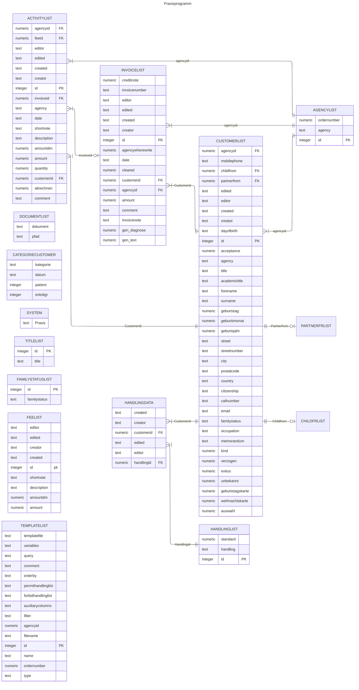
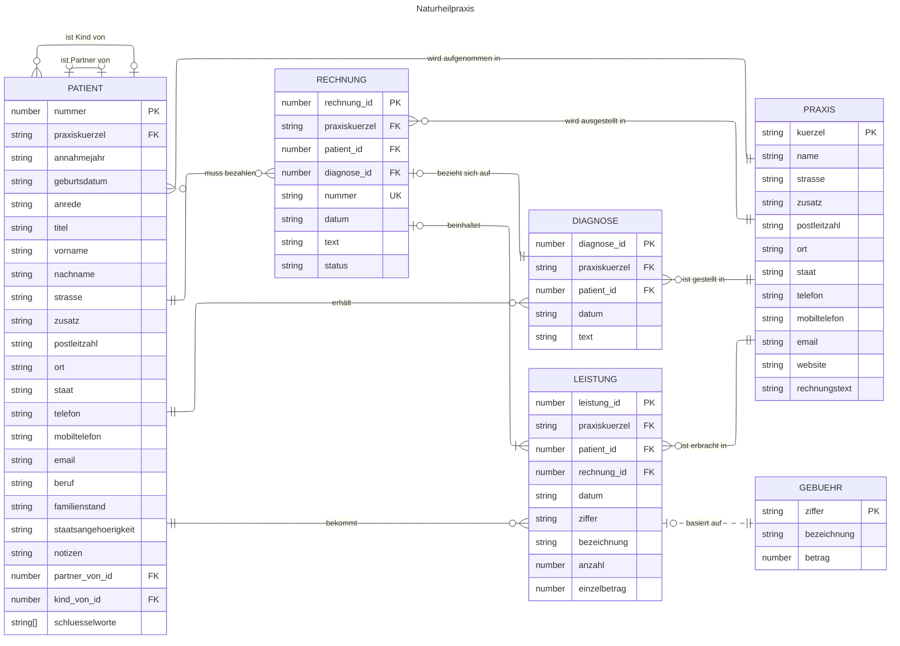

# Naturheilpraxis

[Architecture Communication Canvas](https://html-preview.github.io/?url=https://github.com/falkoschumann/naturheilpraxis/blob/main/docs/acc.html)

## Migration

### Legacy Datenbankschema

Das folgende Schema dokumentiert die aktuelle SQLite-Datenbank.

### Schema der Zieldatenbank

Das folgende Schema beschreibt das Ziel als Basis für das Domain Model.

